In the next step, we use a Dask cluster in the cloud. One option for doing so, is to use [coiled.io](https://www.coiled.io/). 
Coiled can be used with Amazon Web Services (AWS), [Azure](https://docs.coiled.io/user_guide/setup/azure/cli.html) or the Google Cloud Platform ([GCP](https://docs.coiled.io/user_guide/setup/gcp/cli.html)) account. The advantage is that one does not have to bother about the installation of the infrastructure for scaling. 

Till recently, it was possible to use Microsoft's Planetary Computer but this option has been stopped (please see Github discussion [here](https://github.com/microsoft/PlanetaryComputer/discussions/347)),

Below, we use the AWS installation and follow the automated installation and follow the Youtube [video of Coiled](https://www.youtube.com/watch?v=d6XouzFP_AY) but add some additional steps below for setting up AWS in case you are new to this.  We also suggest to create a virtual environment in Miniconda/Anaconda. 

The steps below are done a Windows 10 computer. 

## 1. Prerequisites - Please skip to part 2 if you have this already. 

### a. Python (Miniconda or Ananaconda) installation

The link to install Miniconda (which is more space consuming in comparison to Anaconda) can be found [here](https://docs.anaconda.com/miniconda/miniconda-other-installer-links/). 

If you prefer the larger Anaconda installation, you can proceed with the [Anaconda installation](https://www.anaconda.com/download).

The following Github repository also shows you how to do the installation with Miniconda - **TO ADD**. 

### b. Sign up for an Amazon Web Services (AWS) account. 

The steps for setting up an AWS account can be found in the [AWS documentation](https://docs.aws.amazon.com/SetUp/latest/UserGuide/setup-AWSsignup.html).

It is suggested to use the [AWS Free Tier account](https://aws.amazon.com/free/). This will install your root account for AWS. A good video can be found [here](https://www.youtube.com/watch?v=CjKhQoYeR4Q). 

Optionally, you can protect this root account by using a Multi Factor Authentication (MFA). Please see below for some information.  

After creating your root account, it is safer to create a user account and operate from there. In order to do so, log into your AWS root account first with the password you created in the previous step:


And then fill in your e-mail and password:

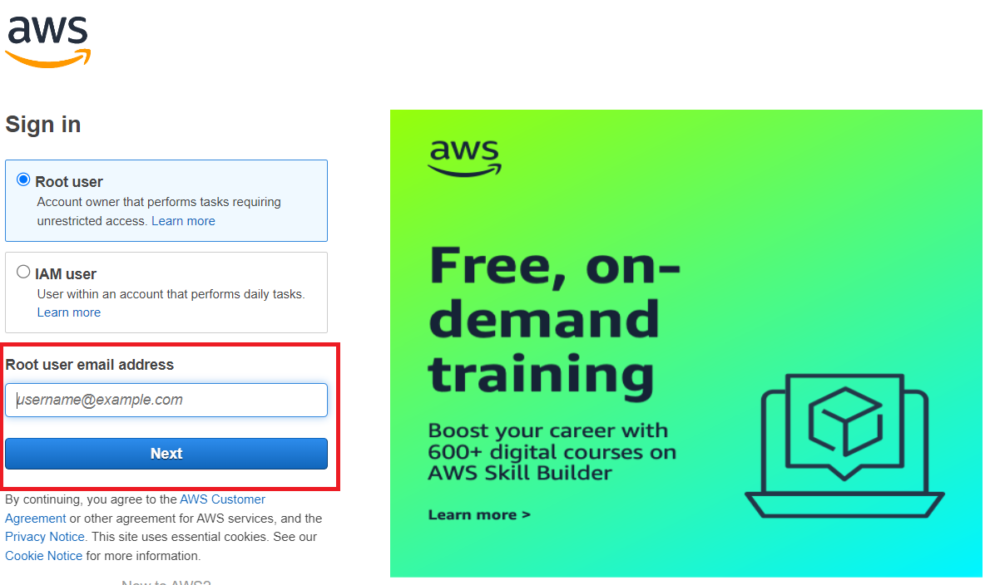

Once you are logged in, type in **IAM** (which stands for Identity and Access Management) on the dashboard and click on **IAM**:


If you want to enable (optionally) Multi Factor Authentication (MFA) as an extra level of safety, you will be prompted for this (and this usually happens through the app on your phone). For more information, please see the [AWS documentation](https://aws.amazon.com/iam/features/mfa/) and [video](https://www.youtube.com/watch?v=e6A7z7FqQDE). 	Twilio, Authy Authenticator, Duo Mobile, Microsoft Authenticator, Google Authenticator, Symantec VIP are some of the options you can choose. We are using Authy (as it allows different accounts at the same time).

Next, we create a new User (for administrative tasks). Click on **Users**:


Click on "Create user**:


And click on **Provide user access to the AWS Management Console - optional**, select **I want to create an IAM user** and select **custom password**, type in a password, uncheck **Users must create a new password at next sign-in - Recommended** and click on **Next**:


In the next page, click on **Attach policies directly** and select **AdministratorAccess**. Alternatively, you can add users to a group (which you e.g. call "admin" and attach the policies in that group instead): 


Scroll down and click on **Next**:


In the next page, you can click on **Create user**:


From now on, you can forget about the root account and continue further with this user account. Click on **Download the .csv file** that shows your details (as you will need them to log in from the user account). Optionally, you can also click on **Email sign-in instructions**:

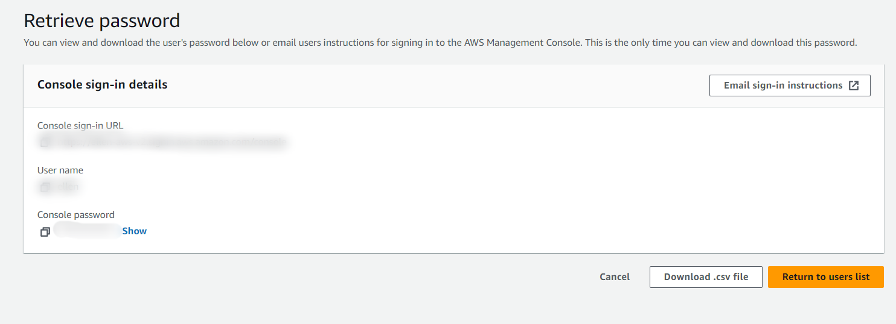 - TO BLUR OUT

Log out from the root account and log in from the user account going forward:

 - TO BLUR OUT

You will get the following window. Notice that optionally you can also here activate the MFA:

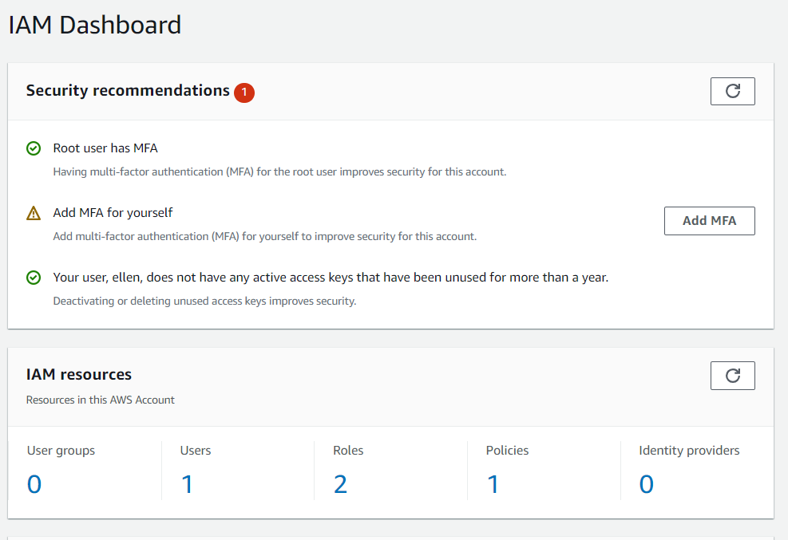


## 2. Install coiled 

It is advisable to create a virtual environment in Miniconda (or Anaconda). Open the **Miniconda/Anaconda Prompt** or **Terminal** by going to the **Windows Start** and type in **miniconda** which launches the Anaconda/Miniconda prompt: 


At the prompt, type `conda create -n coiledenv`. You can choose any other name other than coiledenv if you prefer as this is just an example. Press **Enter**:

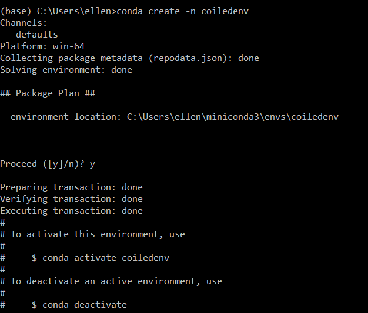

Activate the conda environment by typing: `conda activate coiledenv` and press **Enter**:

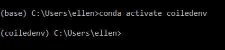

Install (by using pip or conda) the coiled Python library:
```
pip install coiled "dask[complete]"
```
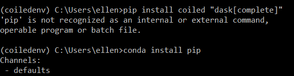

If this gives an error like "", you need to install "pip" first, install pip first:

```
conda install pip
```

Before creating the API token next, ensure that you are signed into Coiled (using your password you have created in the previous step).

Create the Coiled API token from you Miniconda/Anaconda environment by typing:

```
coiled login
```
The following screen opens in Coiled. Click on **Authorize access**:

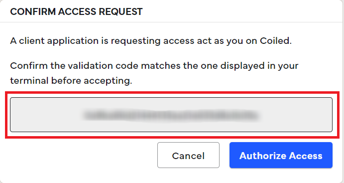 - TO BLUR

Check if the token on the Anaconda prompt matches the token in your coiled dashboard:

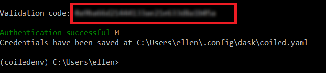 - TO BLUR


## 3. Connect to your cloud

Sign into your Coiled account: 

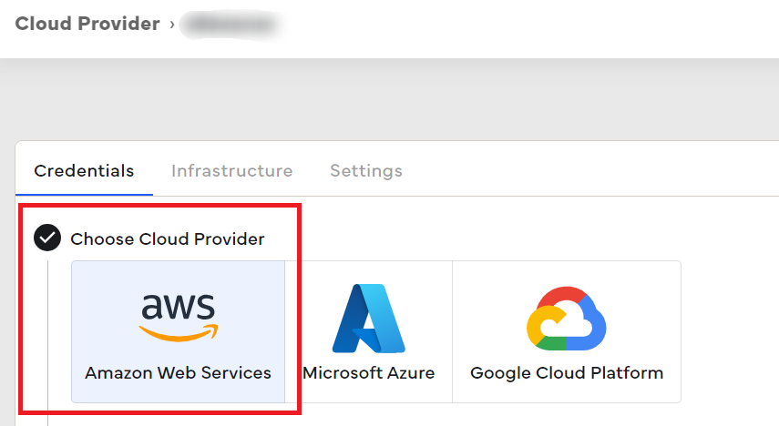 -TO ADD AND RENUMBER

Go to the **Cloud Provider** and click on **AWS**:

 - TO BLUR

Log into the AWS account using your user account (and not your root account):

In the section **Before you start**, click on **Next**:

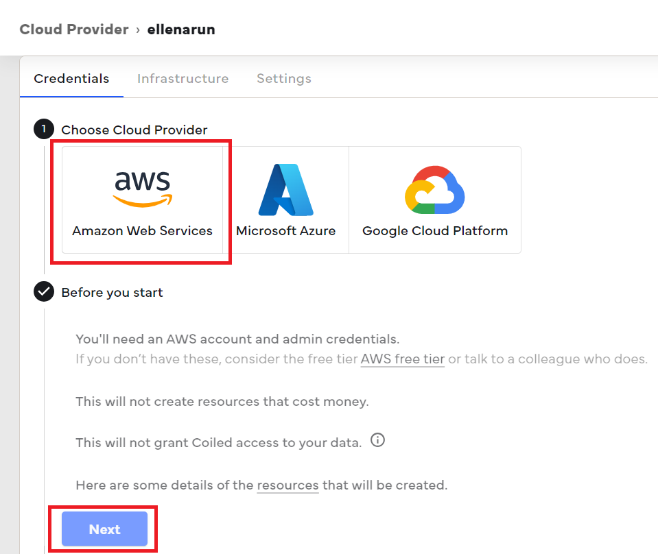 

In the **Credentials**, click on **Connect to AWS**:

 

The following page opens:

 

Check **I promise to come back here after I click Create stack** and click on **LaunchCloudFormation**:

 

The following page opens in AWS (truncated):

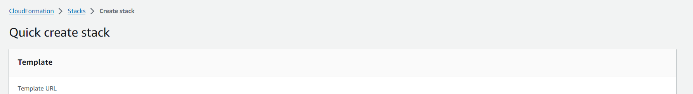 

Click on **I acknowledge that AWS CloudFormation might create IAM resources** and click on "Create stack":

 

Once installation is done, you will get this:

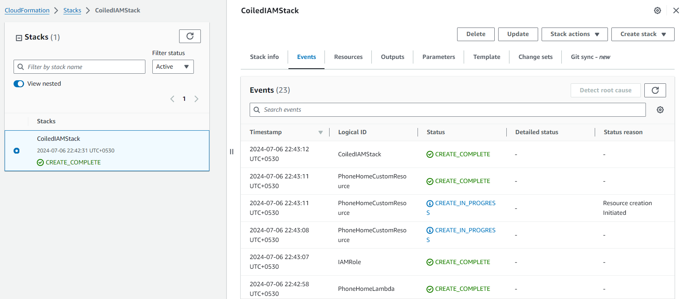 


Go to the Anaconda Prompt and type in:
```
coiled run echo "Hello, world"
```

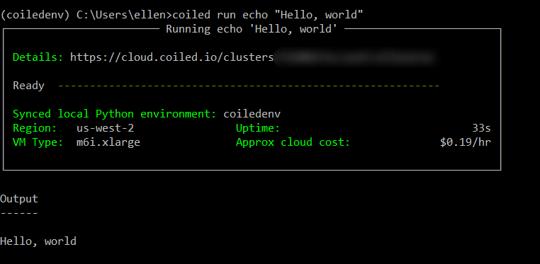 - BLUR

You can also see in your dashboard that your cluster has run:

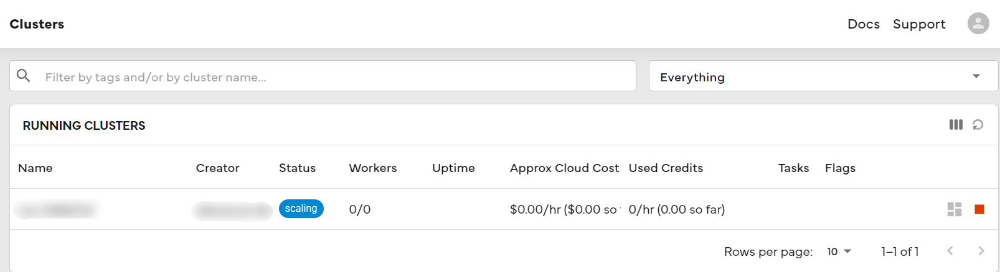 - BLUR


   
